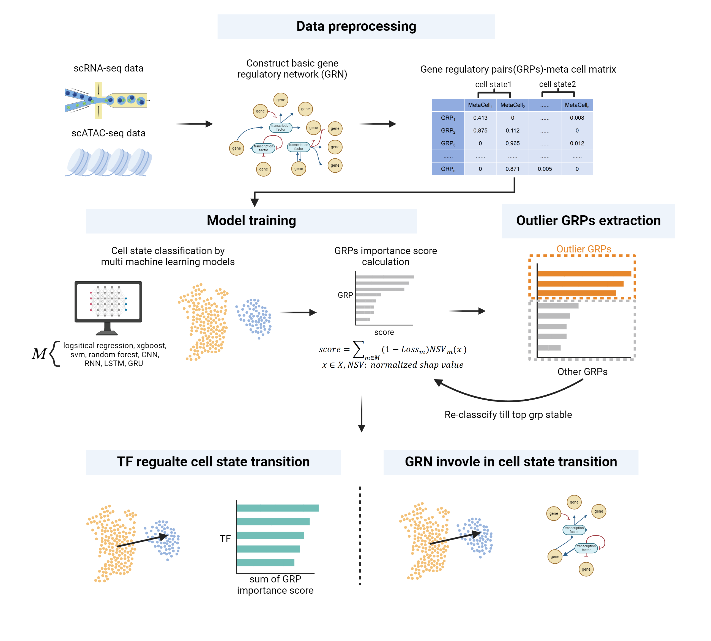

# FateAxis
 FateAxis is a machine learning framework to identify key transcription factors that regulate cell state transition.

# Workflow

# Install
git clone https://github.com/jiang-junyao/FateAxis.git

pip install .

# Acknowledgement
### Jack Yu (Ludwig-Maximilians-Universität München)
### Chen Li (Peking University)
